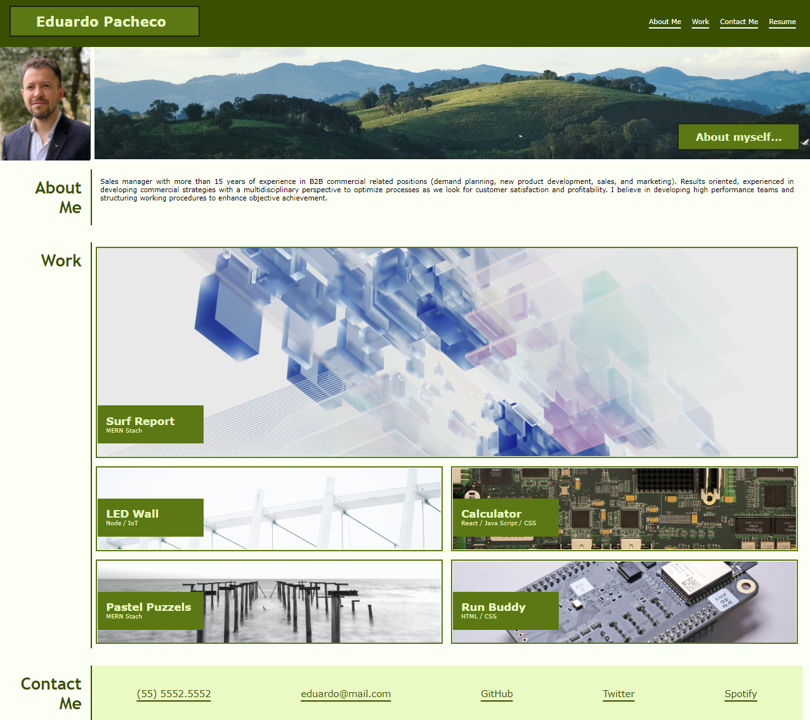

# PERSONAL PORTFOLIO (about_myself)

The objetcive of this project is to showcase a personal portfolio which includes information that span from profile picture, professional objective as well as different projects and achievments.

Current Version of prtfolio does not include any project given that they will be included as the Bootcamp progress. <strong>THE ONLY LINK that works is the RESUME which shows a PDF of my resume</strong>.

## Page Structure

Page is built in 3 Main Blocks

1. Header  
    1.1 Main Title 
    1.2 Nav Bar to different sections in the website 

2. Banner 
    2.1 Profile Pic 
    2.2 Banner Picture 
    2.3 Subtitle 

3. Main Section 
    3.1 About me 
    3.2 Work 
        3.2.1 Surf Report 
        3.2.2 Led Wall 
        3.2.3 Calculator 
        3.2.4 Pastel Puzzels 
        3.2.5 Run Buddy 

4. Contact Me 
    4.1 Nav Bar 

